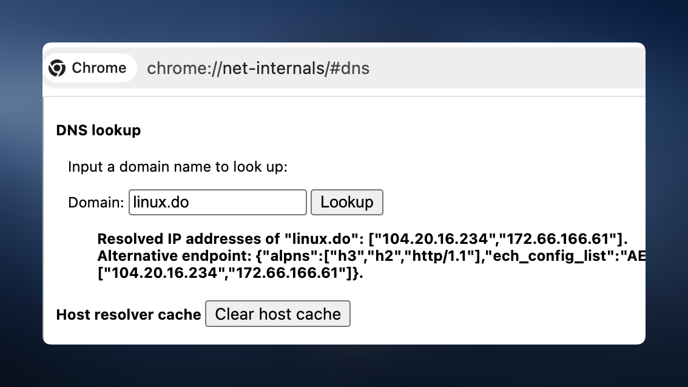
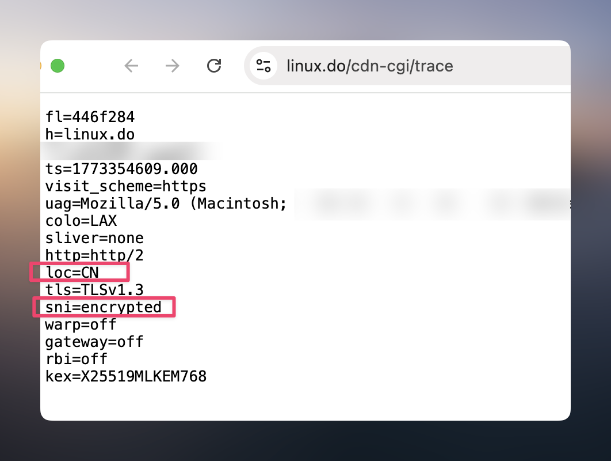

# 如何让 macOS 上开启 Shadowrocket 不影响 Chrome (开启安全 DNS) 来直连访问 `linux.do` ？

## TL;DR

  - 当 Shadowrocket 代理软件运行时，Chrome 的 DoH + ECH 保护会失效，导致无法直连访问 `linux.do`
  - 失效原因是 Shadowrocket 有两道流量拦截机制：系统代理 和 TUN 模式。
    - Chrome 一旦检测到系统代理，就不再自行做 DoH/ECH。
    - 即使绕过了系统代理，TUN 还会劫持流量并重新建立 TCP 连接。
  - 两种解决方案：
    - 方法一：绕过系统代理 + 配置 `cloudflare-ech.com` 直连规则（Shadowrocket 代为直连）
    - 方法二：绕过系统代理 + 绕过 TUN（Chrome 完全直连）

## 为何设置了 Chrome 浏览器的「安全 DNS」就可无需「代理软件」来直连访问 `linux.do` ？
>**简单来说：Chrome 通过「DoH」避免了运营商「DNS 污染」，通过「ECH」解决了运营商的「SNI 阻断」，从而实现无需「代理软件」来直连访问 `linux.do`。**

- 设置「安全 DNS」，即配置了 DoH (DNS over HTTPS) 加密 DNS 查询，防止运营商知道我们在解析什么域名，从而解决 DNS 污染。

- 但是我们虽有**张良计**，运营商也有**过墙梯**，由于 HTTPS 在建立 TLS 连接时，第一个握手包（称为 Client Hello）中，包含了想要访问的域名信息字段 **SNI** (Server Name Indication)，且此字段是不会加密的，所以运营商就可以通过 SNI 就知道我们想要访问什么网站，从对此连接进行阻断，这就是 **SNI 阻断**。

- 为了解决运营商 SNI 阻断，我们还需要「**ECH (Encrypted Client Hello）**」，它的作用是加密 TLS 握手包中的 SNI 字段，当 Chrome 开启了「安全 DNS」，会默认开启「ECH 保护」 (但是由网站是否支持所决定)。
  >具体原理简单来说，构造 TLS Client Hello 时包了两层 SNI
  >**外层（Outer）SNI** 是 `cloudflare-ech.com` (该 SNI 是由 `linux.do` 的 DNS HTTPS 记录决定的)，此 SNI 无加密，运营商只能看到的是此 SNI
  >**内层（Inner）SNI** 是 `linux.do` (真正访问的域名)，此 SNI 会被加密，运营商看不见

## 为何使用了「Shadowrocket 代理软件」会导致 Chrome 的 DoH 和 ECH 失效？

原因：Shadowrocker 默认会开启「系统代理」和「TUN 模式」

### 系统代理:
Chrome 若检测到「系统代理」，会将「DNS 解析」和「请求」交给「系统代理程序 (Shadowrocket)」来处理，导致 Chrome 不进行 DoH 和 ECH 保护。
 >**就算 Shadowrocket 配置的 DNS 服务器是 DoH 的，只能解决「DNS 污染」问题，因为 Shadowrocket 不支持 ECH 保护，所以无法解决「SNI 阻断」问题。**

### TUN 模式:
走到 TUN 模式，说明 Chrome 并没有走「系统代理」（即关闭了系统代理，或配置 skip-proxy 跳过代理），也说明 Chrome 已经进行了「DoH」并对 TLS 的第一次握手包进行了「ECH 保护」。

Shadowrocket 的「TUN 模式」是通过修改路由表，从而劫持所有流量 (除了旁路路由的 IP)，所以「当 TLS 第一次握手包」会被 TUN 捕获，因又进行过 ECH 加密，所以 Shadowrocket 看到的 SNI 域名是 `cloudflare-ech.com`，TUN 也是根据 Rule (规则) 来处理连接和域名 `cloudflare-ech.com`。

但无论是走 `DIRECT` 还是 `PROXY`，都会重新建立一个**新的 TCP 连接来出站**

- **若是 `PROXY`，构建新的 TCP 连接，连接的是「代理服务器」，然后将 Chrome 的  HTTPS TLS 第一次握手包，原封不动进行加密，交给「代理服务器」来处理，「代理服务器」解密后，转发给 `linux.do` 服务器进行 ECH 解密，走完 ECH 流程，成功建立完 TLS 隧道，之后正常 HTTPS 数据传输，但这并不是「直连」，而是「代理转发」。**
  >Chrome -> Shadowrocket TUN -> 代理服务器 -代理-> `linux.do` 服务器

- **若是 `DIRECT` (定义了规则 `DOMAIN-SUFFIX,cloudflare-ech.com,DIRECT`)，构建新的 TCP 连接，将 Chrome 的  HTTPS TLS 第一次握手包，原封不动发给 `linux.do` 服务器进行 ECH 解密，走完 ECH 流程，成功建立完 TLS 隧道，之后正常 HTTPS 数据传输，这是 Shadowrocket 与 `linux.do` 直连。**
  >Chrome -> Shadowrocket TUN -直连-> `linux.do` 服务器

## 如何让使用了「Shadowrocket 代理软件」，也不会让 Chrome 的 DoH 和 ECH 保护失效？

### 方法一 (Chrome "不"完全直连访问)：
>Chrome -> Shadowrocket TUN -直连-> `linux.do` 服务器

- **绕过第一道「系统代理」拦截，配置 `skip-proxy (跳过代理)`**
- **「不」绕过第二道「TUN 捕获」的拦截**
- **配置直连规则 `DOMAIN-SUFFIX,cloudflare-ech.com,DIRECT`**

编辑配置文件
```ini
[General]
# 第一道：让 linux.do 绕过系统代理
skip-proxy = ...,linux.do,*.linux.do

[Rule]
# 配置直连 cloudflare-ech.com （该 SNI 是由 linux.do 的 DNS HTTPS 记录决定的）
DOMAIN-SUFFIX,cloudflare-ech.com,DIRECT
```
### 方法二 (Chrome 完全直连访问)：
>Chrome -直连-> `linux.do` 服务器

根据上面可知，根本原因是 Shadowrocket 的两道拦截「系统代理」和「TUN 模式」，所以只要**绕过此两道拦截即可以让 Chrome 完全直连访问 `linux.do`**
- **绕过第一道「系统代理」的拦截，配置 `skip-proxy (跳过代理)`**
- **绕过第二道「TUN 捕获」的拦截，配置 `tun-excluded-routes (TUN 旁路路由)`**

编辑配置文件
```ini
[General]
# 第一道：让 linux.do 绕过系统代理
skip-proxy = ...,linux.do,*.linux.do

# 第二道：让 linux.do 的 IP 绕过 TUN（/32 表示精确匹配单个 IP）
tun-excluded-routes = ...,104.20.16.234/32,172.66.166.61/32
```

### 额外：如何查询 `linux.do` 的 IP
- Chrome 开启「安全 DNS」
- Chrome 访问 `chrome://net-internals/#dns`，输入 `linux.do` 来查询
  

### 额外：检查是否通过 ECH 访问 `linux.do`
- https://linux.do/cdn-cgi/trace
  
