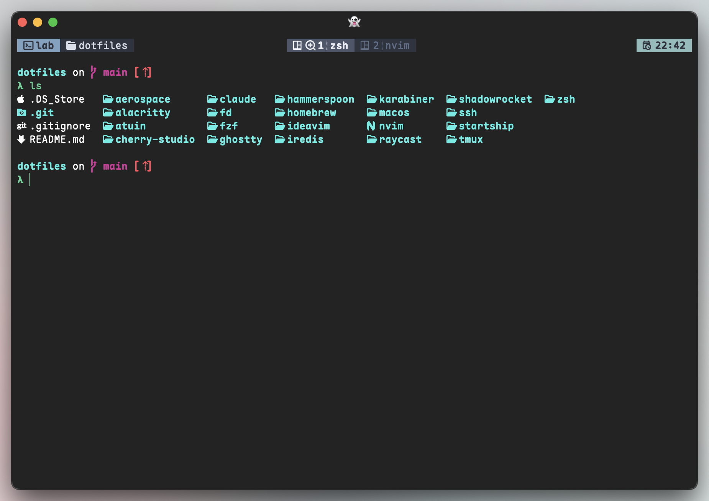
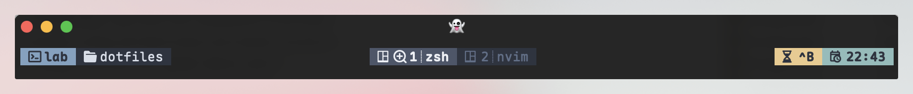
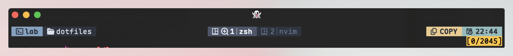

# Tmux Configuration
## Theme

My personal tmux configuration with Nord-inspired theme.

Theme file: [theme.conf](./themes/theme.conf)

Load the theme in **tmux.conf**
```conf
source-file "$YOUR_PATH/theme.conf"
```

### Normal Mode

> The default status line appearance:



### Prefix Mode

> Status line after pressing the prefix key (`Ctrl+b`):



### Copy Mode

> Status line when in copy mode:


