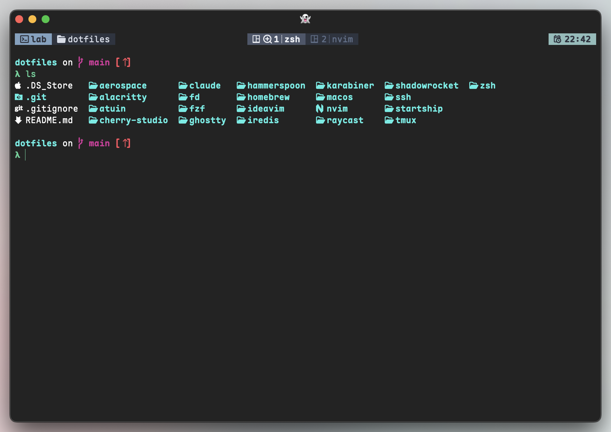
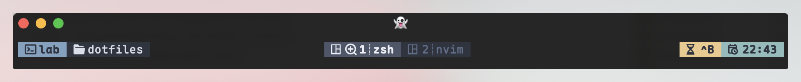
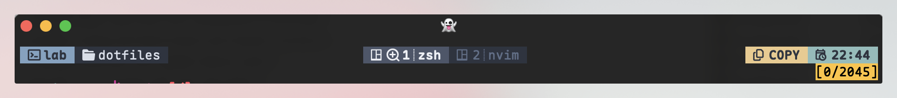
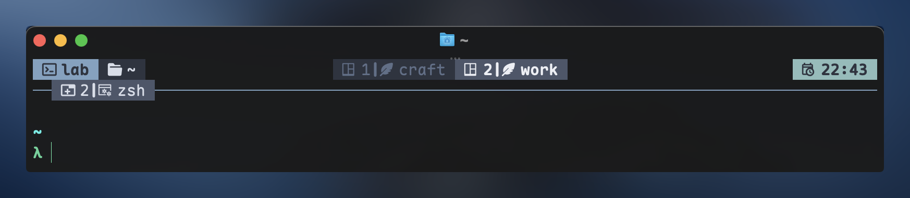
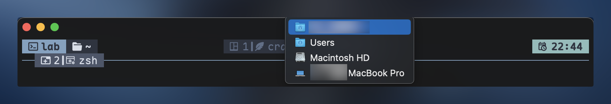
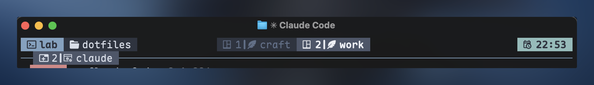

# Tmux Configuration

My personal tmux configuration with Nord-inspired theme.

## Theme

Theme file: [theme.conf](./themes/theme.conf)

Load the theme in **tmux.conf**

```tmux
source-file "$YOUR_PATH/theme.conf"
```

CPU/RAM metrics scripts: [themes/scripts/](./themes/scripts/) **(copied from [tmux-plugins  tmux-cpu](https://github.com/tmux-plugins/tmux-cpu))**

<details>
<summary>Disable CPU/RAM display</summary>

Comment out [lines 43-47 in theme.conf](./themes/theme.conf#L43-L47)

```sh
# Comment the lines below if you don't want CPU/RAM block
sh_cpu="#($HOME/.config/tmux/themes/scripts/cpu_percentage.sh)"
sh_ram="#($HOME/.config/tmux/themes/scripts/ram_percentage.sh)"
block_cpu_ram="#[fg=${nord_four_snow},bg=${nord_zero_black},nobold]  ${sh_cpu}   ${sh_ram} #[default]"
set -ag status-right "${block_cpu_ram}"
```

</details>


### Normal Mode

> The default status line appearance:



### Prefix Mode

> Status line after pressing the prefix key (`Ctrl+b`):



### Copy Mode

> Status line when in copy mode:



## Ghostty Proxy Icon & Title





Show the macOS proxy icon + cwd path in Ghostty's title bar under tmux, same as a plain Ghostty window.

**Principle**: Ghostty's zsh integration emits OSC 7 (cwd) on every prompt / `cd`; Ghostty sets it as the window's `representedURL`, and macOS renders the proxy icon. tmux sits in between as a full terminal emulator — it doesn't pass OSC 7 through, but parses it into the pane (`#{pane_path}`) and re-emits a new one to Ghostty via the `Swd` capability on redraw.

**tmux.conf**:

```tmux
set -as terminal-features ",xterm-ghostty:osc7"  # declare Swd support (tmux auto-enables it only for iTerm2/foot)
set -g set-titles on                             # hard prerequisite: tmux re-emits OSC 7 only with titles on
set -g set-titles-string "#T"                    # forward pane title, so the title matches a plain Ghostty window
```

**~/.zshrc** — cover shells missed by Ghostty's ZDOTDIR auto-injection (tmux panes, `exec zsh`), and drop oh-my-zsh's redundant OSC 7 hook:

```zsh
if [[ -n $GHOSTTY_RESOURCES_DIR ]]; then
  source "$GHOSTTY_RESOURCES_DIR"/shell-integration/zsh/ghostty-integration
  add-zsh-hook -d precmd omz_termsupport_cwd  # Ghostty reports cwd itself
fi
```
